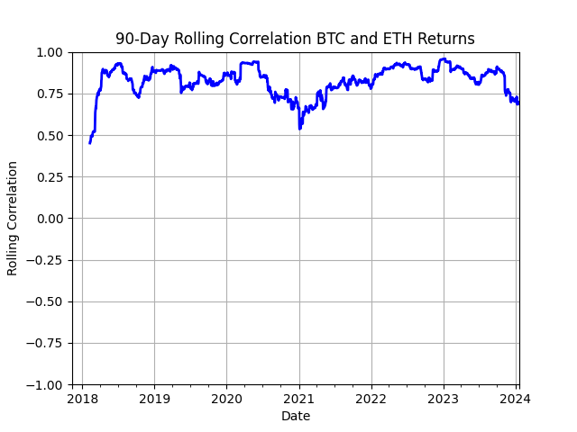
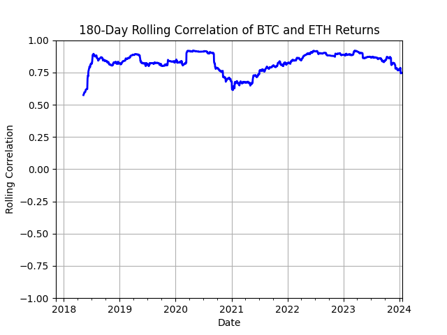

# ETH_BTC_CORRELATION

## Intro

In creating a bigger project, I will be building each component seperately first and giving them their own github page. I want to include the correlation of various assets, both the matrix and the rolling correlation time series. This small project will show you the correlation of ETH and BTC daily returns and volume, also the daily correlation of ETC and BTC where one of the assets daily return is lagged by $n$ amount of days. I will present the results in this README, while the code is in cor_mat.ipynb, with the data for BTC and ETH taken from [Kaggle][1] ranging from 2017-2024.

## Our Data

The data collected gives a daily open and close of both prices, along with the date. It has been speculated that ETH trails BTC, we will look at the relationship of daily returns on the daily scale. Moreover, we will look at the correlation of the daily returns on day $n$ based on daily returns of the previous 90, and 180 days seperately. The correlation we are using is the Pearson Correlation, **NOTE** the Pearson Correlation can only tell us about a *linear* relationship between the two random variables. Let's look at them now!

## Daily Returns Correlation

The Pearson Correlation measures the linear relationship between two random variables, using its standart deviation, using the formula:\
$\rho_{x,y} = \dfrac{Cov(x,y)}{\sigma_x \sigma_y}$\
What we can do is use the last $n$ days for calculating the $Cov(x,y)$ and $\sigma_i$. Below is the 90 and 180 day rolling correlation.

We can see the two are similar, and very closely correlated, where the 180 day window is a *smoothed* out version of the 90 day one.

## Daily Returns Correlation Lagged

For these graphs, we will look at the daily return correlation of BTC on day $n$ and ETH on day $n-i$, or visa versa. Each can be plotted on the same graph where for each $i$, a different color is used when plotted. As we have seen, the 180 and 90 windows only differ in smoothness, so both of these will be 180 day window in correlation. The first graph will look at the correlation of the daily returns of ETH with the daily returns of BTC $i$ days ago. The second graph will look at the correlation of the daily returns of BTC and the daily returns of ETH $i$ days ago.

_to_ETH_Returns.png)
_Return.png)

The value which stands out in both graphs is the value of $i=0$, i.e. same day, while the rest show no significant correlation.

## What's next

So we have found close to no correlation in the daily returns of ETH and BTC, where either one is lagged in terms of days. Maybe the 'lag' happens on the scale shorter than days, and retail traders are faster than this. The next step will be to look at the lag on the scale of hours/minutes. Moreover, it could be possible for there to exist a non-linear correlation, and a different correlation coefficient could be used to investigate this. Thanks for reading!

[1]:https://www.kaggle.com/datasets/kapturovalexander/bitcoin-and-ethereum-prices-from-start-to-2023?select=ETH-USD+%2801-05.2024%29.csv "Kaggle"
